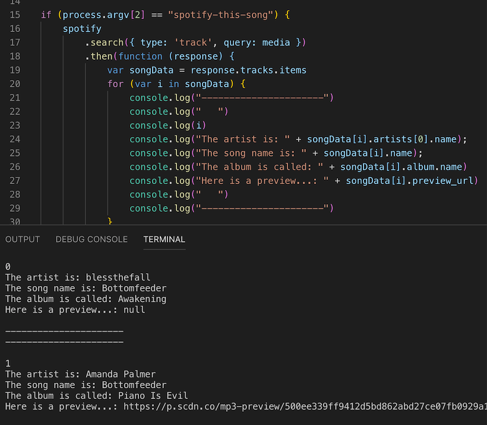
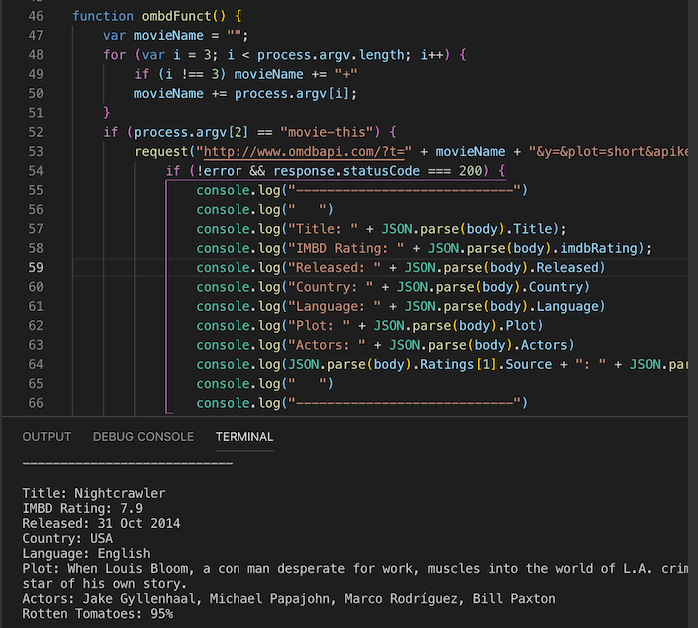
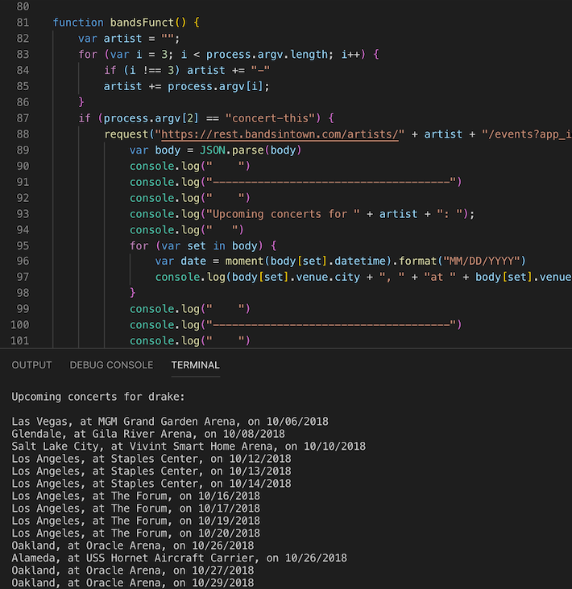

# liri-node-app

# Overview

## This is a Language Interpretation and Recognition node app. It's purpose is to take in parameters from the user and return information from the given API.

1. Song info based on the track name.
2. Movie info based on the movie name.
3. Event info based on the artist name.
---
Everything from the APIs must show up in the console with a console.log

This program requires the following modules to function.

1. [Node-Spotify-API](https://www.npmjs.com/package/node-spotify-api)
2. [Request](https://www.npmjs.com/package/request)
3. [Moment](https://www.npmjs.com/package/moment)
4. [DotEnv](https://www.npmjs.com/package/dotenv)

Spotify is particular about who uses their API, so you must set up a Client ID and Secret ID...

...and put the keys in the .env file.

# How Liri Works

Liri uses the 3rd arguement in the command as input for search.

## 1. Search for a song

'node liri.js spotify-this-song ">song name here<"'

    

---

# 2. Search for a movie

'node liri.js movie-this '>movie name here<''

---

# 3. Search for a concert

'node liri.js concert-this >artist/band name here<'

---

# 4. Programmed Search

